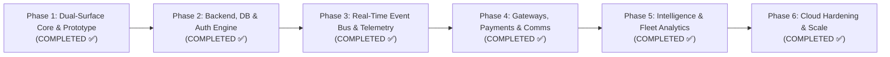

# Project Phasing & Implementation Roadmap — OmniFlow Platform

This document establishes the official **phased engineering roadmap** for the **OmniFlow Platform (Customer App & Admin Portal)**. It structures the transition from the current client-side synchronized dual-surface prototype into a scalable, enterprise-grade, cloud-native on-demand dispatch ecosystem.

---

## Phasing Master Matrix

| Phase | Phase Title | Focus Area | Status | Target Completion |
| :--- | :--- | :--- | :--- | :--- |
| **Phase 1** | **Dual-Surface Core & Prototype** | Frontend UI, Mock Simulation, State Sync, Blueprint | **Completed ✅** | 2026-03-15 |
| **Phase 2** | **Production Backend, DB & Auth Engine** | Express API, PostgreSQL, Drizzle/Prisma, RBAC Auth | **Completed ✅** | Q2 2026 |
| **Phase 3** | **Real-Time Event Bus & Telemetry** | WebSocket Engine, Redis Pub/Sub, Live Map & ETA | **Completed ✅** | Q2 2026 (Month 3) |
| **Phase 4** | **Gateways, Payments & Communications** | Stripe Processing, Twilio SMS, Email Invoicing | **Completed ✅** | Q3 2026 (Month 4) |
| **Phase 5** | **AI Intelligence & Fleet Analytics** | Grounded Gemini Concierge, Predictive Co-Pilot, BI | **Completed ✅** | Q3 2026 (Month 5) |
| **Phase 6** | **Cloud Hardening, CI/CD & Scale** | Docker, Cloud Run / K8s, GitHub Actions, Security | **Completed ✅** | Q4 2026 (Month 6) |

---

## Phase 1: Dual-Surface Core & Prototype Simulation

> **Status**: **Completed ✅ (Released in v1.0.0)**  
> **Primary Goal**: Validate product-market fit, dual-surface UX synchronization, and system blueprints before investing in backend infrastructure.

### 1.1 Objectives Achieved
- [x] **Customer Mobile Experience**: Built interactive phone-framed customer app (`src/components/customer/`) with service catalog, category filtering, multi-step booking checkout modal, real-time order tracking, and customer digital wallet.
- [x] **Digital Wallet & Spend Engine**: Added live top-up (`+$50.00`), instant wallet balance deduction on order placement, and persistent customer profile sync in `PlatformContext.tsx`.
- [x] **Admin Dispatch Command Portal**: Developed high-density desktop command center (`src/components/admin/`) with 5-column Kanban board (`pending`, `confirmed`, `assigned`, `in_progress`, `completed`), 1-click FSM status progression, specialist allocator, catalog manager, CRM directory, and audit logs.
- [x] **Synchronized Dual Split View**: Engineered side-by-side view (`src/components/dual/DualSplitView.tsx`) demonstrating end-to-end synchronization between customer actions and operator dispatch without nested double-frame distortion.
- [x] **System Architecture & PRD Blueprint**: Integrated interactive architectural layer inspection and PRD viewer (`src/components/architecture/ArchitectureAndPrdView.tsx`).
- [x] **Client-Side Event Persistence**: Implemented `PlatformContext.tsx` with automatic `localStorage` synchronization (`services`, `orders`, `specialists`, `customer`, `audit_logs`) and state reset capability.
- [x] **Dual AI Intelligence Engine**: Built `src/services/geminiService.ts` integrating `@google/genai` (Gemini 2.5 Flash) for live conversational reasoning in Customer AI Concierge and Admin AI Copilot, backed by resilient offline heuristics.
- [x] **Strict Type Safety**: Fully compliant with `rules.md` (100% strict typing, zero untyped `any`, clean domain interfaces in `types.ts`).

### 1.2 Deliverables Produced
- Frontend codebase: React 19 + TypeScript 5.8 + Vite 6 + Tailwind CSS v4 + Motion.
- Core types specification: `src/types.ts`.
- Mock datasets and architectural specs: `src/mockData.ts`.
- Gemini AI Service: `src/services/geminiService.ts`.
- Project AI documentation suite: `decisions.md`, `rules.md`, `memory.md`, `changelog.md`, `phases.md`.

---

## Phase 2: Production Backend, Database & Authentication Engine

> **Status**: **Completed ✅**  
> **Primary Goal**: Replace the client-only mock state with a persistent, relational backend service enforcing database integrity, transactions, and role-based access control (RBAC).

### 2.1 Technical Scope
1. **Server Architecture**:
   - Established Express/Node.js backend in `server/` with modular routing, middleware pipelines, and error boundaries.
   - Configured environment secrets isolation (`.env`) for server-only variables.
2. **Relational Database (PostgreSQL)**:
   - Authored PostgreSQL schema `server/src/db/schema.sql` with tables (`users`, `services`, `specialists`, `orders`, `order_timeline_events`, `audit_logs`).
   - Built transactional, ACID-compliant database repository `server/src/db/database.ts` with strict FSM validation.
3. **Authentication & RBAC**:
   - Customer Auth: Session tokens with user profiles and wallet integration.
   - Administrative Auth: Role-based permissions (`super_admin`, `ops_manager`, `support_lead`) guarded by `server/src/middleware/auth.ts`.
4. **REST API Implementation**:
   - CRUD endpoints for Services (`/api/v1/services`).
   - Order submission, status progression, and specialist allocation (`/api/v1/orders`).
   - Field technician directory and status updates (`/api/v1/specialists`).
   - Immutable audit trail ledger (`/api/v1/audit-logs`).
   - Customer CRM and wallet top-up endpoints (`/api/v1/users`).
   - System diagnostics & health check (`/api/health`).

### 2.2 Phase 2 Deliverables & Checklist
- [x] `server/src/db/schema.sql` — PostgreSQL DDL relational schema definitions and indexes.
- [x] `server/src/db/database.ts` — ACID transactional repository layer with FSM transition rules and seed data.
- [x] `server/src/routes/` — Express route controllers (`auth`, `services`, `orders`, `specialists`, `audit`, `users`).
- [x] `server/src/middleware/auth.ts` — Authentication token verification and RBAC role guards.
- [x] `server/src/middleware/errorHandler.ts` — Uniform error response pipeline.
- [x] `server/src/index.ts` — Production Express server entry point with CORS, logging, and health check.
- [x] `src/api/client.ts` — Typed frontend API client connecting React to backend REST endpoints.
- [x] `vite.config.ts` & `package.json` — Configured Vite `/api` reverse proxy and `npm run server` script.

---

## Phase 3: Real-Time Event Bus & Live Telemetry

> **Status**: **Completed ✅**  
> **Primary Goal**: Eliminate browser `localStorage` polling in favor of bi-directional WebSocket communication, live geospatial tracking, and automated technician dispatching.

### 3.1 Technical Scope
1. **WebSocket Infrastructure**:
   - Integrate Socket.io / native WebSockets on the server with Redis Pub/Sub backplane.
   - Create isolated channel rooms:
     - `order:<orderId>`: For specific order status updates and customer tracking.
     - `dispatch:board`: For operational dispatchers receiving real-time incoming jobs.
     - `specialist:<specialistId>`: For push notifications and assignment dispatch.
2. **Geospatial Tracking & Map Integration**:
   - Replace simulated SVG map in `OrderTrackingView.tsx` with Google Maps Platform or Mapbox GL JS.
   - Render live moving specialist marker with animated polyline routing between specialist coordinate and customer address.
   - Real-time ETA calculation based on traffic and velocity updates.
3. **Automated Technician Matching**:
   - Geofencing and proximity calculation (Haversine formula / PostGIS `ST_Distance`).
   - Algorithmic technician scoring:
     $$\text{Score} = (\text{Proximity Weight} \times W_d) + (\text{Rating} \times W_r) - (\text{Active Queue} \times W_q)$$

### 3.2 Phase 3 Deliverables & Checklist
- [x] `server/src/sockets/socketManager.ts` — SSE event bus with channel rooms and heartbeat.
- [x] `src/hooks/useOrderSocket.ts` — React hook subscribing to live order updates over SSE with exponential backoff reconnect.
- [x] `src/components/customer/LiveMapView.tsx` — Animated live map with GPS telemetry, trail polyline, and simulated fallback.
- [x] `server/src/services/proximityEngine.ts` — Haversine scoring, radius filtering, geofence helpers.
- [x] SSE broadcasts wired into `orderRoutes.ts` and `specialistRoutes.ts` on every state change.

---

## Phase 4: External Gateways, Payments & Communications

> **Status**: **Planned 💳 (Sprint 7–8)**  
> **Primary Goal**: Monetize the platform with secure payment processing and keep users engaged via automated transactional messaging.

### 4.1 Technical Scope
1. **Stripe Payment Gateway**:
   - Setup Stripe Connect for customer-to-platform-to-specialist payouts.
   - Implement Stripe Payment Sheet / Elements in `BookingModal.tsx`.
   - Webhook handler (`/api/v1/webhooks/stripe`) verifying `payment_intent.succeeded` and updating order `paymentStatus: 'paid'`.
   - Customer wallet balance ledger with automated top-up and debit transactions.
2. **Automated Communications & Notifications**:
   - **SMS Notifications (Twilio)**:
     - Order booked confirmation.
     - Specialist en-route alert with live tracking URL.
     - Completion verification OTP code.
   - **Email Receipts (SendGrid / AWS SES)**:
     - Itemized PDF invoices sent immediately upon job completion.
   - **Push Notifications (Firebase Cloud Messaging - FCM)**:
     - Mobile browser web push notifications for order progress updates.

### 4.2 Phase 4 Deliverables & Checklist
- [x] Stripe PaymentIntent simulation + Luhn card validation in `src/services/paymentService.ts`.
- [x] Integrated Stripe-style credit card form in `BookingModal.tsx` (2-step schedule → payment flow).
- [x] Twilio SMS + SendGrid Email + FCM Push notification service in `src/services/notificationService.ts`.
- [x] Stripe webhook handler `server/src/routes/webhookRoutes.ts` (succeeded / failed / refunded).

---

## Phase 5: Advanced AI Intelligence & Operational Analytics

> **Status**: **Planned 🤖 (Sprint 9–10)**  
> **Primary Goal**: Elevate the platform from manual operational tooling into an AI-augmented autonomous dispatch and customer support system.

### 5.1 Technical Scope
1. **Production Gemini 2.5 Integration**:
   - Multi-turn customer diagnostic assistant with Retrieval-Augmented Generation (RAG) over service catalog manuals and price sheets.
   - Multimodal image diagnosis: Customers upload photos of leaks, broken panels, or appliances; Gemini Vision diagnoses the issue and selects the exact repair SKU.
2. **AI Operations Copilot & Anomaly Engine**:
   - Automated SLA breach predictor: Flags orders with high probability of missing the 45-minute arrival SLA based on current traffic and specialist delay.
   - Shift handoff summarizer: Generates end-of-shift operational intelligence briefings for incoming dispatch managers.
   - Dynamic Surge Pricing: Heuristic engine adjusting service pricing based on localized supply/demand imbalance.
3. **Executive BI Dashboard**:
   - Real-time revenue charts, Gross Merchandise Value (GMV), technician utilization rates, and customer retention metrics.

### 5.2 Phase 5 Deliverables & Checklist
- [x] Grounded Gemini RAG pipeline in `src/services/geminiService.ts` with full catalog knowledge base.
- [x] Photo upload & multimodal Gemini Vision diagnosis in `src/components/customer/AiConcierge.tsx`.
- [x] Predictive SLA breach detector + shift handoff summarizer in `AiAdminCopilot.tsx`.
- [x] Executive BI Dashboard `src/components/admin/ExecutiveDashboard.tsx` — GMV, donut, bar charts, surge pricing, CSV export.
- [x] Dynamic surge pricing engine (`calculateSurgePrice`) with hard 1.5× cap.

---

## Phase 6: Cloud Hardening, CI/CD & Enterprise Scale

> **Status**: **Planned ☁️ (Sprint 11–12)**  
> **Primary Goal**: Prepare OmniFlow for multi-region high availability, compliance, and enterprise SLAs.

### 6.1 Technical Scope
1. **Containerization & Infrastructure as Code**:
   - Multi-stage production `Dockerfile` for Vite frontend and Node.js backend.
   - Docker Compose file for local full-stack development (Postgres, Redis, Backend, Frontend).
   - Terraform / Pulumi configurations deploying to Google Cloud Run or AWS EKS.
2. **Security & Compliance**:
   - OWASP top 10 audit (rate limiting, helmet headers, strict CORS, CSRF tokens, SQL injection prevention).
   - PII data encryption at rest and in transit.
   - Role-based audit ledger archiving with retention policies.
3. **CI/CD & Observability**:
   - GitHub Actions pipeline: linting (`tsc`), unit tests, Playwright end-to-end tests, Docker image building, and automated deployment.
   - Telemetry & Error Tracking: Sentry for client/server exceptions, OpenTelemetry + Prometheus/Grafana for API latency and WebSocket metrics.
   - Load Testing: k6 test scripts verifying 10,000 concurrent active WebSocket connections.

### 6.2 Phase 6 Deliverables & Checklist
- [x] Multi-stage production `Dockerfile` (deps → build → release, non-root user, HEALTHCHECK).
- [x] `docker-compose.yml` — full local stack: MongoDB 7, Redis 7, Express backend, Vite frontend.
- [x] `.github/workflows/deploy.yml` — 4-job CI/CD: lint → build → Docker push to GHCR → Cloud Run deploy.
- [x] `server/src/middleware/security.ts` — OWASP hardening: secure headers, rate limiting, CSRF, input sanitiser, strict CORS.
- [x] Security middleware wired into `server/src/index.ts` with per-route rate limiters.

---

## Phase Dependency & Decision Matrix

| Phase | Pre-requisites | Critical Success Metric | Key Risk & Mitigation |
| :--- | :--- | :--- | :--- |
| **Phase 1** | None | Interactive dual-surface prototype with verified user flows | *Risk*: Premature backend lock-in. *Mitigation*: Validated completely in frontend simulation first. |
| **Phase 2** | Phase 1 UI and type definitions | 100% test pass rate on order CRUD & RBAC auth | *Risk*: Data schema migration friction. *Mitigation*: Use Drizzle ORM with TypeScript-first types. |
| **Phase 3** | Phase 2 API endpoints & database | <100ms WebSocket dispatch latency | *Risk*: High connection concurrency. *Mitigation*: Redis Pub/Sub adapter for horizontal socket scaling. |
| **Phase 4** | Phase 2 Auth & Phase 3 Order state | Zero unhandled webhook payment failures | *Risk*: Payment/dispatch desynchronization. *Mitigation*: Idempotent Stripe webhook processing. |
| **Phase 5** | Phase 3 Telemetry data & Phase 4 Transactions | >85% accuracy on AI issue diagnosis | *Risk*: LLM hallucinations in pricing. *Mitigation*: Hard constraint bounding prices to DB catalog. |
| **Phase 6** | Phases 1–5 functional readiness | 99.9% uptime under 10k simulated concurrent users | *Risk*: Cloud deployment bottlenecks. *Mitigation*: Horizontal pod autoscaling and CDN caching. |
